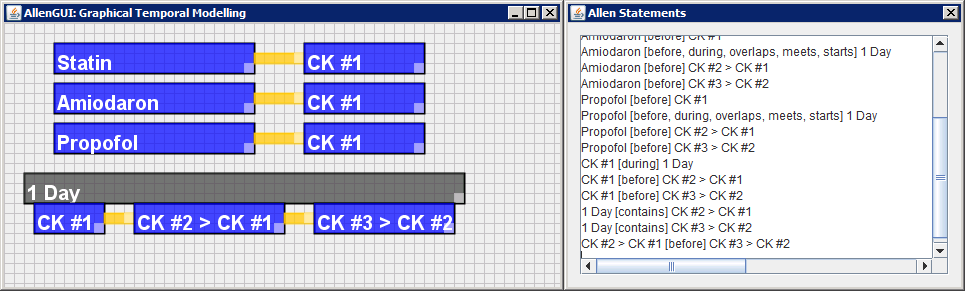

# AllenGUI

AllenGUI is a graphical query modelling tool based on Allen's interval algebra (see: http://cse.unl.edu/~choueiry/Documents/Allen-CACM1983.pdf).

The tool uses the library "allentemporalrelationships" by Jörn Franke (see: https://github.com/jornfranke/allentemporalrelationships).

The project can be build with Eclipse. Using the tool is simple:

   - To create a new intervall or connector: Left-click and drag the mouse
   - To delete an interval: Right-click on the interval
   - To rename an interval: Middle-click on the interval

The tool automatically updates "TemporalLogic.txt", which can be post-processed by AllenSPARQL (see: https://github.com/sebmate/AllenSPARQL) or by other tools.

